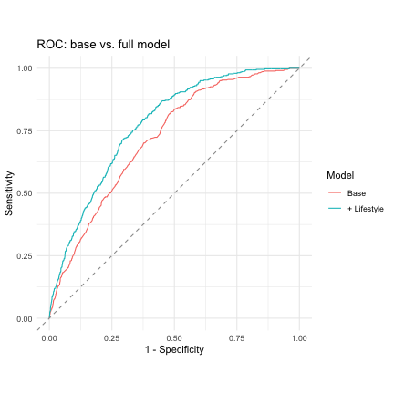

``` r
library(dplyr)
```

```
## 
## Attaching package: 'dplyr'
```

```
## The following objects are masked from 'package:stats':
## 
##     filter, lag
```

```
## The following objects are masked from 'package:base':
## 
##     intersect, setdiff, setequal, union
```

``` r
library(broom)
library(pROC)
```

```
## Type 'citation("pROC")' for a citation.
```

```
## 
## Attaching package: 'pROC'
```

```
## The following objects are masked from 'package:stats':
## 
##     cov, smooth, var
```

``` r
library(ggplot2)

# Read the corrected, regenerated dataset (see 01_data_cleaning.R)
path <- file.path("data", "Datensatz", "nhanes_cleaned_variablen.csv")
raw  <- read.csv(path, stringsAsFactors = FALSE)

# Analysis population: adults (age >= 18, legal adulthood in the EU)
ad <- raw %>%
  filter(age >= 18) %>%
  mutate(
    diabetes       = factor(diabetes, levels = c(0, 1), labels = c("No", "Yes")),
    gender         = factor(gender),
    origin         = factor(origin),
    education_level= factor(education_level),
    smoking_status = factor(smoking_status, levels = c("Never", "Former", "Current")),
    hypertension   = factor(hypertension,  levels = c(0, 1), labels = c("No", "Yes")),
    heart_attacks  = factor(heart_attacks, levels = c(0, 1), labels = c("No", "Yes")),
    stroke         = factor(stroke,        levels = c(0, 1), labels = c("No", "Yes"))
  )

cat("Adults (age >= 18):", nrow(ad),
    "| Diabetes = Yes:", sum(ad$diabetes == "Yes"),
    sprintf("(%.1f%%)", 100 * mean(ad$diabetes == "Yes")))
```

```
## Adults (age >= 18): 7876 | Diabetes = Yes: 1073 (13.6%)
```

# Background and aim

The requirements describe a generic workflow for relating modifiable **lifestyle
factors** to a binary clinical outcome. This dataset contains no Alzheimer variable;
its outcome is **diabetes** (NHANES `DIQ010`), so diabetes is used as the binary target
and the Alzheimer wording is treated as a methodological template.

The data were cleaned with per-variable missing-code handling (see
`docs/01_data_quality_issue.md`); the earlier blanket rule had deleted valid values such as
ages 7/9/77 and sleep durations of 7 h / 9 h.

We proceed from simple to complex: **(1)** univariate screening (Chi²/t-tests),
**(2)** multiple logistic regression with odds ratios, **(3)** hierarchical regression to
quantify the added value of lifestyle over non-modifiable factors, and **(4)** model
performance via ROC/AUC and a confusion matrix.

# Variable groups


``` r
nonmod   <- c("age", "gender", "origin")                  # Block 1 (non-modifiable)
lifestyle<- c("bmi", "smoking_status", "sleep_duration",
              "moderate_min_week", "sugar_intake")          # Block 2 (modifiable)

cont_vars <- c("age", "bmi", "sleep_duration", "sugar_intake",
               "calorie_intake", "alcohol_week", "moderate_min_week")
cat_vars  <- c("gender", "origin", "education_level", "smoking_status", "hypertension")
```

`alcohol_week` and the lab values (LDL/HDL/triglycerides) are screened univariately but
kept out of the core model: alcohol is ~50% missing (non-drinkers skip the item, so
complete-case use would bias the sample) and labs are ~60% missing.

# 1. Descriptive statistics ("Table 1")


``` r
summ_cont <- function(v) {
  s <- ad %>% group_by(diabetes) %>%
    summarise(mean = mean(.data[[v]], na.rm = TRUE),
              sd   = sd(.data[[v]],   na.rm = TRUE),
              n    = sum(!is.na(.data[[v]])), .groups = "drop")
  data.frame(variable = v,
             No_mean_sd  = sprintf("%.1f (%.1f)", s$mean[s$diabetes=="No"],  s$sd[s$diabetes=="No"]),
             Yes_mean_sd = sprintf("%.1f (%.1f)", s$mean[s$diabetes=="Yes"], s$sd[s$diabetes=="Yes"]))
}
do.call(rbind, lapply(cont_vars, summ_cont))
```

```
##            variable     No_mean_sd    Yes_mean_sd
## 1               age    50.0 (18.7)    63.5 (12.4)
## 2               bmi     29.0 (7.1)     33.0 (7.9)
## 3    sleep_duration      7.7 (1.6)      7.8 (1.9)
## 4      sugar_intake    97.5 (70.1)    85.1 (61.7)
## 5    calorie_intake 1994.7 (916.5) 1869.5 (896.6)
## 6      alcohol_week      2.6 (2.2)      2.6 (2.5)
## 7 moderate_min_week  294.5 (467.3)  257.9 (455.2)
```


``` r
# Categorical: % within diabetes group
cat_pct <- function(v) {
  t <- table(ad[[v]], ad$diabetes)
  p <- prop.table(t, margin = 2) * 100
  data.frame(variable = v, level = rownames(t),
             No  = sprintf("%d (%.1f%%)", t[, "No"],  p[, "No"]),
             Yes = sprintf("%d (%.1f%%)", t[, "Yes"], p[, "Yes"]),
             row.names = NULL)
}
do.call(rbind, lapply(cat_vars, cat_pct))
```

```
##           variable                level           No         Yes
## 1           gender               Female 3788 (55.7%) 555 (51.7%)
## 2           gender                 Male 3015 (44.3%) 518 (48.3%)
## 3           origin     Mexican American   491 (7.2%)   89 (8.3%)
## 4           origin   Non-Hispanic Asian   358 (5.3%)   49 (4.6%)
## 5           origin   Non-Hispanic Black  817 (12.0%) 190 (17.7%)
## 6           origin   Non-Hispanic White 4021 (59.1%) 545 (50.8%)
## 7           origin Other / Multi-Racial   442 (6.5%)   87 (8.1%)
## 8           origin       Other Hispanic   674 (9.9%) 113 (10.5%)
## 9  education_level           <9th grade   247 (3.8%)  103 (9.7%)
## 10 education_level         9-11th grade   487 (7.6%) 146 (13.7%)
## 11 education_level    College graduate+ 2336 (36.2%) 212 (19.9%)
## 12 education_level    College/Associate 1964 (30.5%) 328 (30.8%)
## 13 education_level      High school/GED 1413 (21.9%) 276 (25.9%)
## 14  smoking_status                Never 4215 (62.2%) 529 (49.4%)
## 15  smoking_status               Former 1582 (23.3%) 370 (34.6%)
## 16  smoking_status              Current  980 (14.5%) 171 (16.0%)
## 17    hypertension                   No 4776 (70.3%) 299 (27.9%)
## 18    hypertension                  Yes 2018 (29.7%) 772 (72.1%)
```

# 2. Univariate screening

## 2.1 t-tests (continuous factors)

Welch two-sample t-tests comparing diabetic vs. non-diabetic adults.


``` r
ttest_row <- function(v) {
  f  <- as.formula(paste(v, "~ diabetes"))
  tt <- t.test(f, data = ad)
  data.frame(variable = v,
             mean_No  = round(tt$estimate[1], 2),
             mean_Yes = round(tt$estimate[2], 2),
             t        = round(tt$statistic, 2),
             df       = round(tt$parameter, 0),
             p_value  = signif(tt$p.value, 3),
             row.names = NULL)
}
tt_tab <- do.call(rbind, lapply(cont_vars, ttest_row))
tt_tab$signif <- ifelse(tt_tab$p_value < 0.05, "*", "")
tt_tab
```

```
##            variable mean_No mean_Yes      t   df   p_value signif
## 1               age   50.00    63.48 -30.48 1939 5.01e-167      *
## 2               bmi   29.02    32.96 -13.62 1080  4.07e-39      *
## 3    sleep_duration    7.74     7.79  -0.83 1270  4.06e-01       
## 4      sugar_intake   97.47    85.11   4.77 1007  2.13e-06      *
## 5    calorie_intake 1994.69  1869.55   3.38  943  7.59e-04      *
## 6      alcohol_week    2.63     2.62   0.07  534  9.45e-01       
## 7 moderate_min_week  294.48   257.95   1.97  863  4.97e-02      *
```

## 2.2 Chi-square tests (categorical factors)


``` r
chi_row <- function(v) {
  tab <- table(ad[[v]], ad$diabetes)
  ct  <- suppressWarnings(chisq.test(tab))
  data.frame(variable = v,
             X_squared = round(ct$statistic, 2),
             df        = ct$parameter,
             p_value   = signif(ct$p.value, 3),
             row.names = NULL)
}
chi_tab <- do.call(rbind, lapply(cat_vars, chi_row))
chi_tab$signif <- ifelse(chi_tab$p_value < 0.05, "*", "")
chi_tab
```

```
##          variable X_squared df   p_value signif
## 1          gender      5.71  1  1.69e-02      *
## 2          origin     40.86  5  1.00e-07      *
## 3 education_level    186.37  4  3.19e-39      *
## 4  smoking_status     73.23  2  1.26e-16      *
## 5    hypertension    724.06  1 1.75e-159      *
```

# 3. Multiple logistic regression

A complete-case sample on all model variables ensures the hierarchical models (Section 4)
are nested on identical rows.


``` r
model_vars <- c("diabetes", nonmod, lifestyle)
md <- ad[complete.cases(ad[, model_vars]), ]
cat("Complete-case modelling sample:", nrow(md),
    "| Diabetes = Yes:", sum(md$diabetes == "Yes"),
    sprintf("(%.1f%%)", 100 * mean(md$diabetes == "Yes")))
```

```
## Complete-case modelling sample: 3811 | Diabetes = Yes: 445 (11.7%)
```


``` r
full_fml <- as.formula(
  paste("diabetes ~", paste(c(nonmod, lifestyle), collapse = " + ")))
m_full <- glm(full_fml, data = md, family = binomial)

# Odds ratios with 95% CI
or_tab <- tidy(m_full, exponentiate = TRUE, conf.int = TRUE) %>%
  filter(term != "(Intercept)") %>%
  transmute(term,
            OR       = round(estimate, 3),
            CI_low   = round(conf.low, 3),
            CI_high  = round(conf.high, 3),
            p_value  = signif(p.value, 3),
            signif   = ifelse(p.value < 0.05, "*", ""))
or_tab
```

```
## # A tibble: 13 × 6
##    term                          OR CI_low CI_high  p_value signif
##    <chr>                      <dbl>  <dbl>   <dbl>    <dbl> <chr> 
##  1 age                        1.05   1.05    1.06  2.86e-39 "*"   
##  2 genderMale                 1.61   1.29    2.00  1.87e- 5 "*"   
##  3 originNon-Hispanic Asian   0.576  0.276   1.14  1.26e- 1 ""    
##  4 originNon-Hispanic Black   0.921  0.578   1.48  7.33e- 1 ""    
##  5 originNon-Hispanic White   0.366  0.244   0.561 2.17e- 6 "*"   
##  6 originOther / Multi-Racial 0.681  0.395   1.17  1.66e- 1 ""    
##  7 originOther Hispanic       0.756  0.453   1.27  2.85e- 1 ""    
##  8 bmi                        1.08   1.07    1.10  9.87e-29 "*"   
##  9 smoking_statusFormer       1.23   0.966   1.56  9.15e- 2 ""    
## 10 smoking_statusCurrent      1.69   1.22    2.33  1.41e- 3 "*"   
## 11 sleep_duration             1.02   0.95    1.09  6.04e- 1 ""    
## 12 moderate_min_week          1      1       1     2.05e- 1 ""    
## 13 sugar_intake               0.996  0.995   0.998 2.73e- 4 "*"
```

**Interpretation.** OR > 1 = risk factor, OR < 1 = protective, OR = 1 = no effect.
Each estimate is adjusted for all other variables in the model (control for confounders),
e.g. the BMI effect is the change in the *odds* of diabetes per 1-unit BMI increase,
holding age, sex, ethnicity and the other lifestyle factors constant.

# 4. Hierarchical (block-wise) regression

How much does lifestyle add **beyond** non-modifiable factors?


``` r
m1 <- glm(as.formula(paste("diabetes ~", paste(nonmod, collapse = " + "))),
          data = md, family = binomial)                       # Block 1
m2 <- m_full                                                   # Block 2 (full)

mcfadden <- function(m) 1 - as.numeric(logLik(m) / logLik(update(m, . ~ 1)))

lrt <- anova(m1, m2, test = "LRT")
data.frame(
  model      = c("Block 1: non-modifiable", "Block 2: + lifestyle"),
  predictors = c(length(nonmod), length(c(nonmod, lifestyle))),
  AIC        = round(c(AIC(m1), AIC(m2)), 1),
  pseudoR2   = round(c(mcfadden(m1), mcfadden(m2)), 4)
)
```

```
##                     model predictors    AIC pseudoR2
## 1 Block 1: non-modifiable          3 2515.5   0.0902
## 2    Block 2: + lifestyle          8 2379.6   0.1440
```


``` r
cat("Likelihood-ratio test (Block 1 vs Block 2):\n")
```

```
## Likelihood-ratio test (Block 1 vs Block 2):
```

``` r
cat(sprintf("  Chi2 = %.2f, df = %d, p = %.3g\n",
            lrt$Deviance[2], lrt$Df[2], lrt$`Pr(>Chi)`[2]))
```

```
##   Chi2 = 147.90, df = 6, p = 2.15e-29
```

``` r
cat(sprintf("  Delta McFadden pseudo-R2 = %.4f\n", mcfadden(m2) - mcfadden(m1)))
```

```
##   Delta McFadden pseudo-R2 = 0.0538
```

A significant LRT and a higher pseudo-R² / lower AIC indicate that lifestyle factors
provide **additional explanatory value** over age, sex and ethnicity alone.

# 5. ROC curves and AUC


``` r
md$p1 <- predict(m1, type = "response")
md$p2 <- predict(m2, type = "response")

roc1 <- roc(md$diabetes, md$p1, levels = c("No", "Yes"), direction = "<", quiet = TRUE)
roc2 <- roc(md$diabetes, md$p2, levels = c("No", "Yes"), direction = "<", quiet = TRUE)

data.frame(
  model   = c("Block 1 (base)", "Block 2 (+ lifestyle)"),
  AUC     = round(c(auc(roc1), auc(roc2)), 3),
  CI_low  = round(c(ci.auc(roc1)[1], ci.auc(roc2)[1]), 3),
  CI_high = round(c(ci.auc(roc1)[3], ci.auc(roc2)[3]), 3)
)
```

```
##                   model   AUC CI_low CI_high
## 1        Block 1 (base) 0.719  0.696   0.741
## 2 Block 2 (+ lifestyle) 0.774  0.754   0.795
```


``` r
dt <- roc.test(roc1, roc2, method = "delong")
cat(sprintf("DeLong test (base vs full): Z = %.2f, p = %.3g\n",
            dt$statistic, dt$p.value))
```

```
## DeLong test (base vs full): Z = -6.77, p = 1.25e-11
```


``` r
ggroc(list(`Base` = roc1, `+ Lifestyle` = roc2), legacy.axes = TRUE) +
  geom_abline(slope = 1, intercept = 0, linetype = "dashed", colour = "grey60") +
  labs(title = "ROC: base vs. full model", x = "1 - Specificity",
       y = "Sensitivity", colour = "Model") +
  coord_equal() + theme_minimal()
```



# 6. Confusion matrix

A confusion matrix depends on the chosen probability cut-off. With ~12% prevalence the
default 0.5 threshold classifies almost everyone as "No" (high specificity, very low
sensitivity). We therefore report it alongside the **Youden-optimal** threshold (the point
on the ROC curve maximising sensitivity + specificity − 1), which reflects the clinically
relevant trade-off.


``` r
conf_metrics <- function(prob, actual, thr) {
  pred <- factor(ifelse(prob >= thr, "Yes", "No"), levels = c("No", "Yes"))
  cm <- table(Predicted = pred, Actual = actual)
  TP <- cm["Yes","Yes"]; TN <- cm["No","No"]
  FP <- cm["Yes","No"];  FN <- cm["No","Yes"]
  list(cm = cm, stats = c(
    Threshold   = round(thr, 3),
    Sensitivity = round(TP/(TP+FN), 3),
    Specificity = round(TN/(TN+FP), 3),
    Accuracy    = round((TP+TN)/sum(cm), 3),
    Precision   = round(TP/(TP+FP), 3)))
}

thr_youden <- as.numeric(coords(roc2, "best", best.method = "youden",
                                ret = "threshold", transpose = TRUE))
```

```
## Warning in coords.roc(roc2, "best", best.method = "youden", ret = "threshold",
## : 'transpose=TRUE' is deprecated. Only 'transpose=FALSE' will be allowed in a
## future version.
```

``` r
r_05  <- conf_metrics(md$p2, md$diabetes, 0.5)
r_yj  <- conf_metrics(md$p2, md$diabetes, thr_youden)

cat("Threshold = 0.5\n");  print(r_05$cm)
```

```
## Threshold = 0.5
```

```
##          Actual
## Predicted   No  Yes
##       No  3347  423
##       Yes   19   22
```

``` r
cat("\nYouden-optimal threshold =", round(thr_youden, 3), "\n"); print(r_yj$cm)
```

```
## 
## Youden-optimal threshold = 0.132
```

```
##          Actual
## Predicted   No  Yes
##       No  2390  128
##       Yes  976  317
```

``` r
rbind(`0.5` = r_05$stats, `Youden` = r_yj$stats)
```

```
##        Threshold Sensitivity Specificity Accuracy Precision
## 0.5        0.500       0.049       0.994    0.884     0.537
## Youden     0.132       0.712       0.710    0.710     0.245
```

# 7. Summary and interpretation

**Headline.** In these adults, diabetes is overwhelmingly an **age- and adiposity-driven**
condition, and **modifiable lifestyle factors add a real but modest layer of predictive
value** on top of the non-modifiable factors (age, sex, ethnicity). All estimates are
**associations, not causation** (cross-sectional, unweighted, complete-case).

**What predicts diabetes.**

- *Univariate (Sec. 2):* the diabetic group is markedly older (63.5 vs 50.0 y), heavier
  (BMI 33.0 vs 29.0) and far more often hypertensive (72% vs 30%). Counter-intuitively,
  sugar and calorie intake are *lower* in diabetics — almost certainly **reverse causation**
  (diet change after diagnosis), a classic cross-sectional artifact. Sleep and alcohol show
  no univariate difference.
- *Adjusted (Sec. 3):* the independent risk factors are **age** (OR 1.05/yr ≈ +63%/decade),
  **male sex** (1.61), **BMI** (1.08/unit) and **current smoking** (1.69). Sleep and moderate
  activity lose significance once age and BMI are controlled.

**Does lifestyle add value? (Sec. 4)** Yes, significantly: pseudo-R² rises 0.090 → 0.144,
LRT χ² = 147.9 (p ≈ 2×10⁻²⁹), AIC falls 2515 → 2380. Lifestyle contributes genuine extra
explanatory value (Δpseudo-R² ≈ 0.054) — but the non-modifiable block still carries most
of the signal.

**Model performance (Sec. 5–6).** Discrimination improves from AUC 0.719 to 0.774
(DeLong p ≈ 1.3×10⁻¹¹) — useful for risk-stratification, not definitive diagnosis. The
confusion matrix shows why threshold choice matters under ~12% prevalence: at 0.5 the model
reaches 88% accuracy but only 5% sensitivity (useless as a screen — accuracy is misleading
under class imbalance), whereas the Youden-optimal threshold (0.132) balances sensitivity
and specificity at ~71% each.

**Bottom line.** Age, BMI, male sex and current smoking are the independent risk factors;
hypertension co-occurs strongly but is a comorbidity, not a clean lifestyle cause.
Modifiable lifestyle factors **significantly but modestly** improve prediction beyond
age/sex/ethnicity — affirming the project's central question.

**Caveats:** complete-case analysis (no imputation); NHANES survey weights are not applied
(associations, not national-prevalence estimates); the "protective" sugar/calorie effects
are likely reverse causation; `alcohol_week` and lab values were excluded from the core
model due to high, partly structural missingness. See `docs/03_interpretation.md` for the
full discussion.
